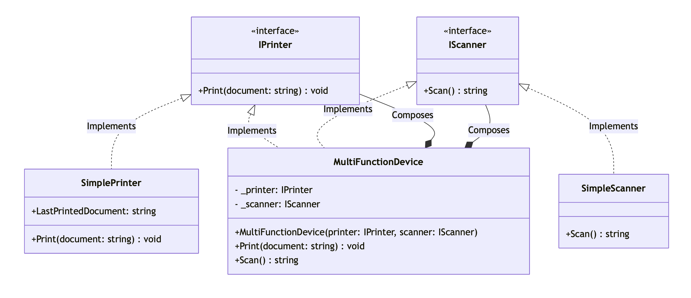

# A08 | SOLID - Interface Segregation Principle |  Office Equipment Capabilities

## Project Overview
This project models various office equipments (printers,scanners, and multifunction devices) to demonstrate the **Interface Segregation Principle**. The architecture ensures that device classes are never forced to implement capabilities they do not support.

## Architecture & Capabilities

The system is broken down into two function specific interfaces rather than a single interface.

*   **`IPrinter`**: Exposes only the `Print(string document)` capability.
*   **`IScanner`**: Exposes only the `Scan()` capability.

### Device Implementations
1.  **`SimplePrinter`**: Implements only `IPrinter`.
2.  **`SimpleScanner`**: Implements only `IScanner`.
3.  **`MultiFunctionDevice`**: Implements both `IPrinter` and `IScanner`.

## Composition of Capabilities
To prevent duplicate code, the `MultiFunctionDevice` utilizes **Composition**. Rather than defining its own printing and scanning logic from scratch, it acts as a composite class. It takes in an `IPrinter` and an `IScanner` component via its constructor and simply assigns the tasks to those dedicated internal components when its methods are invoked.

## Build and Test Instructions

**Using Visual Studio (GUI):**
1. Open the `.sln` file in Visual Studio.
2. **Build:** Select **Build** > **Build Solution** from the top menu.
3. **Test:** Open the **Test Explorer** panel and click **Run All Tests**.

**Using the Command Line (CLI):**
Navigate to the root project directory and execute the following commands:
*   **To Build:** `dotnet build`
*   **To Test:** `dotnet test`

## Test Summary

The `DeviceTests.cs` script acts as the system executive for verifying the state and logic of the architecture without the need for a separate Console Application.

**Test Cases Implemented:**
*   **`SimplePrinter_Test`**: Verifies that the printer successfully receives the string input and updates its internal `LastPrintedDocument` state.
*   **`SimpleScanner_Test`**: Verifies that the scanner returns its default text output.
*   **`MultiFunctionDevice_Test`**: Verifies that the composite class successfully assigns printing and scanning tasks to its internal components.
*   **`MultiFunctionDevice_ErrorTest`**: An edge-case test confirming that the constructor safely throws an `ArgumentNullException` if either component is missing.
